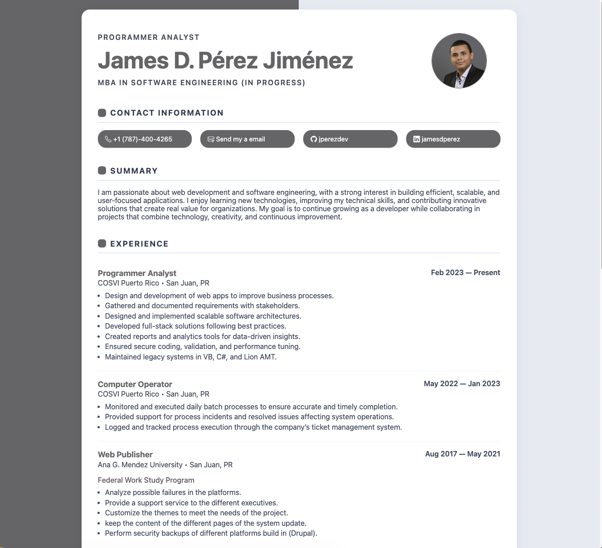
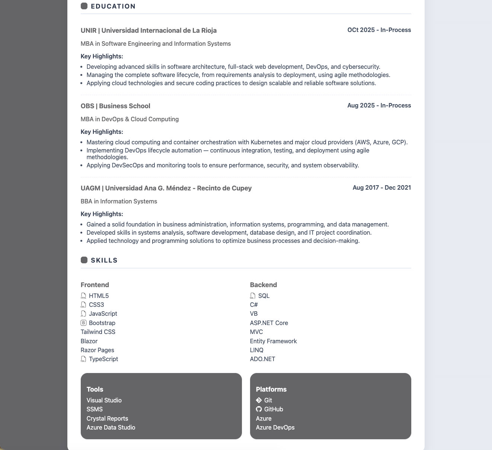

<h1 align="center"> CV - Porfolio Assigment </h1>

<h5>Project Description:</h5>
<h4>Tools that facilitated the development:</h4>
<ul>
  <li>HTML 5</li>
  <li>CSS 3</li>
  <li>GitHub</li>
  <li>Google Fonts</li>
  <li>Bootstrap Icons</li>
  <li>Animate CSS Library</li>
</ul>

Note: Two screenshots were taken from my CV page to capture the entire design.

Developer: James D. Pérez Jiménez

<h6>Build in 2025</h6>
